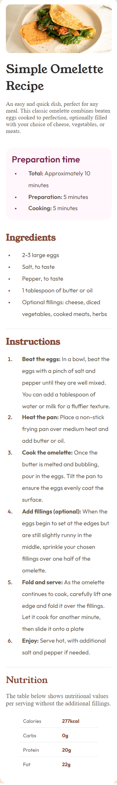
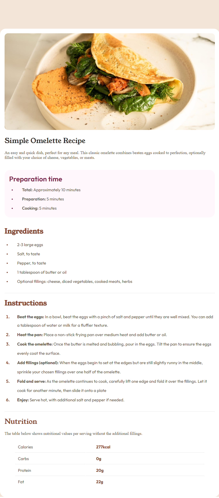

# Recipe Page - Simple Omelette

A responsive recipe page for displaying an omelette recipe, built with HTML and CSS. This project features a clean layout with structured sections for ingredients, instructions, and nutritional information.





## Features

- Responsive design for all screen sizes
- Semantic HTML5 structure
- Google Fonts integration (Outfit & Young Serif)
- Organized content sections:
  - Preparation time
  - Ingredients list
  - Numbered instructions
  - Nutrition table
- CSS custom properties for consistent styling
- Image optimization ready

## Setup Instructions

1. Clone the repository:
```bash
git clone https://github.com/Amitk4600/recipe-page.git